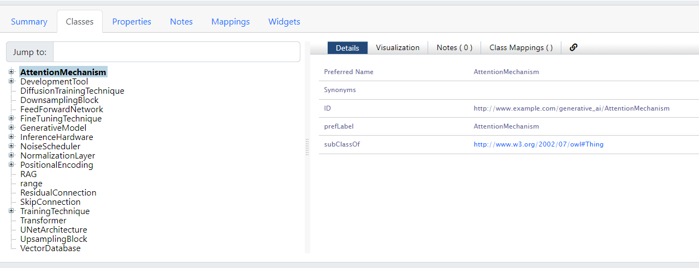

# Generative AI Ontology 

Welcome to the **Generative AI Ontology** repository. This repository contains an extensive and detailed OWL ontology that covers the full scope of generative AI systems. The ontology incorporates advanced classes, properties, and relationships, representing model types, architectures, components, training techniques, tools, deployment methods, and frameworks for research and proof-of-concept (PoC) development.

## Overview

This ontology provides a structured and interconnected representation of generative AI concepts, allowing researchers and developers to model, analyze, and extend generative AI systems effectively. It supports the exploration of different model architectures, fine-tuning techniques, training methods, evaluation metrics, and ethical considerations.

### Key Features

- **Generative Model Types**: Comprehensive coverage of various models, including Large Language Models (LLMs), Diffusion Models, Autoregressive Models, GANs, and VAEs.
- **Transformer Architecture Components**: Details the essential building blocks of transformer models, such as attention mechanisms, normalization layers, and feedforward networks.
- **Training Techniques**: Explores various approaches including self-supervised learning, reinforcement learning (RL), and RL from human feedback (RLHF).
- **Fine-Tuning Methods**: Covers advanced techniques like LoRA (Low-Rank Adaptation), Prompt Tuning, and Adapter Tuning.
- **Development Tools and Frameworks**: Incorporates tools such as Gradio, Streamlit, Flask, Hugging Face, and Ollama for building and deploying generative AI models.
- **Infrastructure Components**: Models the hardware used for inference, such as GPUs and CPUs.
- **Ethics and Governance**: Includes methods for bias mitigation, privacy preservation, and algorithmic fairness.

## Ontology Structure

### 1. Generative Model Types

- **GenerativeModel**: The superclass for all types of generative models.
- **LLM (Large Language Model)**:
  - Subclass of `GenerativeModel`.
  - **Properties**:
    - `architecture`: Describes the model architecture (e.g., transformer).
    - `usesPretrainedWeights`: Indicates if pretrained weights are used.
    - `supportsTokenization`: Links the model to supported tokenization methods.
- **DiffusionModel**:
  - Includes properties like `usesNoiseScheduler` and `usesUNetArchitecture`.
- **AutoregressiveModel**:
  - Represents models generating sequences (e.g., GPT models).
  - **Properties**:
    - `sequenceLength`: Specifies the maximum sequence length.
- **GAN**:
  - Subclass representing GAN architectures.
  - **Properties**:
    - `discriminator`, `generator`: Connect GAN components.
    - `lossFunction`: Describes the loss function used.

### 2. Transformer Architecture Components

- **Transformer**: Represents the transformer architecture.
- **AttentionMechanism**: Central to transformer functionality.
  - Subclasses include **SelfAttention** and **MultiHeadAttention**.
- **PositionalEncoding**: Mechanisms for encoding positional information.
  - Subclasses include **AbsolutePositionalEncoding** and **RelativePositionalEncoding**.
- **NormalizationLayer**:
  - Subclasses: **LayerNormalization** and **BatchNormalization**.
- **FeedForwardNetwork** and **ResidualConnection**: Essential components in transformer layers.

### 3. Diffusion Model Components

- **NoiseScheduler**: Manages noise during diffusion processes.
  - Subclasses: **LinearScheduler** and **NonLinearScheduler**.
- **UNetArchitecture**: The backbone for diffusion models.
- **DownsamplingBlock**, **UpsamplingBlock**, and **SkipConnection**: Components of the UNet structure.

### 4. Training Techniques

- **TrainingTechnique**: The superclass for training methodologies.
  - Subclasses:
    - **SelfSupervisedLearning**: Unsupervised learning method.
    - **ReinforcementLearning**: Includes RLHF as a subclass.
    - **DiffusionTrainingTechnique**: Specific to diffusion models.

### 5. Fine-Tuning Techniques for LLM and Multimodal

- **FineTuningTechnique**: Represents various fine-tuning approaches.
  - Subclasses:
    - **LoRA**: Low-Rank Adaptation method.
    - **PromptTuning**: Adjusts prompts for optimization.
    - **AdapterTuning**: Adds adapters to models for task-specific training.

### 6. Retrieval-Augmented Generation (RAG) and Vector Databases

- **RAG**: Incorporates retrieval-based techniques for enhancing generation.
- **VectorDatabase**: Represents databases storing vector embeddings for retrieval.

### 7. Tools and Frameworks for Development

- **DevelopmentTool**: The superclass for development tools.
  - Subclasses:
    - **Gradio**, **Streamlit**, **Flask**: Frameworks for building web-based interfaces.
    - **HuggingFace**: Platform for model sharing and deployment.
    - **Ollama** and **MAGMA**: Tools for model management and experimentation.
    - **Colab**: Represents Google's Colab for development.

### 8. Infrastructure Components for Deployment and Training

- **InferenceHardware**: Represents hardware used in AI deployment.
  - Subclasses:
    - **GPU**: Graphics Processing Unit for accelerated training and inference.
    - **CPU**: Central Processing Unit for standard processing tasks.

### 9. Relationships

- **usesQuantizationMethod**: Links models to the quantization technique used.
- **trainsWith**: Connects models to training techniques.
- **evaluatesWith**: Associates models with evaluation metrics.
- **appliesEthicalGuideline**: Connects models or processes to ethical guidelines.
- **combinesModality**: Links multimodal models with modality types.
- **implementsAttentionMechanism**: Links models to specific attention mechanisms.
- **hasPositionalEncoding**: Describes positional encoding applied in models.
- **usesOptimizationAlgorithm**: Connects training techniques with optimization methods.
- **deploysVia**: Specifies deployment methods and platforms.
- **usesDevelopmentTool**: Links development tools to model development processes.
- **runsOnHardware**: Associates models with hardware types for deployment.

## Usage

This ontology can be applied to:

- **Research and Development**: Model generative AI systems, fine-tune approaches, and explore development tools.
- **Proof-of-Concept (PoC) Development**: Integrate the ontology into PoC environments to explore model deployment, training techniques, and hardware configurations.
- **Ethics and Governance**: Model ethical considerations such as bias mitigation and privacy preservation.

## Contribution

We welcome contributions from the community. If you are interested in extending the ontology or fixing issues, please submit a pull request or open an issue. Contributions help make this ontology a valuable resource for the generative AI community.

## License

This ontology is open-source and licensed under the MIT License. Please review the license file for more details.

